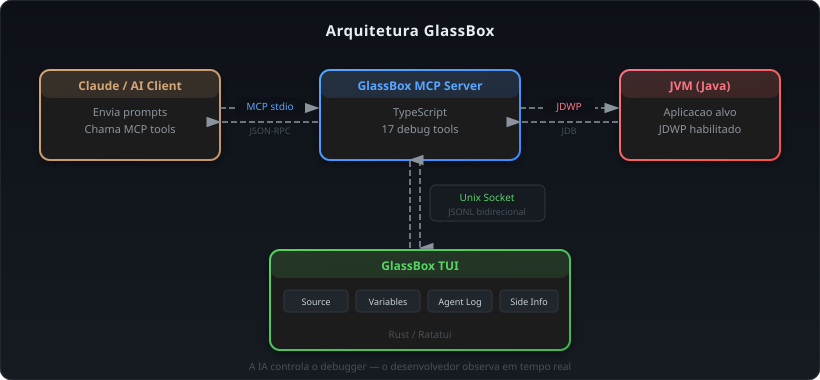
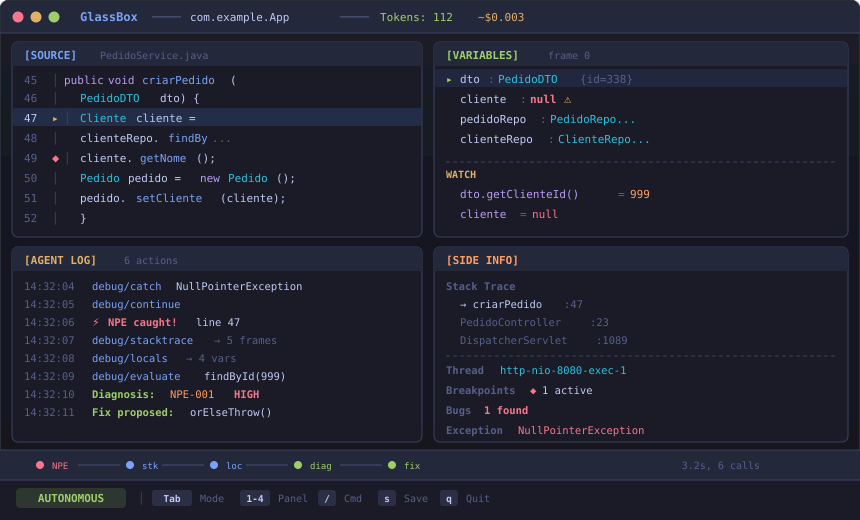

# GlassBox

**Debug inteligente para JVM via MCP — a IA controla o debugger, você observa.**

GlassBox é um debugger de JVM controlado por inteligência artificial, construído sobre o [Model Context Protocol (MCP)](https://modelcontextprotocol.io). Diferente de debuggers tradicionais onde o desenvolvedor opera o debugger manualmente, o GlassBox inverte o modelo: a IA conduz a investigação (define breakpoints, inspeciona variáveis, navega pelo stack) enquanto o desenvolvedor acompanha tudo em tempo real por uma interface de terminal (TUI).

## Arquitetura

<p align="center">
  
</p>

O projeto é um monorepo com dois pacotes:

| Pacote | Linguagem | Descrição |
|--------|-----------|-----------|
| `packages/mcp-server` | TypeScript | Servidor MCP com 17 tools de debug, backend JDB |
| `packages/tui` | Rust | Interface de terminal em tempo real com Ratatui |

## Funcionalidades

### 17 Ferramentas MCP

As ferramentas estão organizadas em 5 categorias:

| Categoria | Ferramentas | Descrição |
|-----------|-------------|-----------|
| **Lifecycle** (3) | `debug/launch`, `debug/attach`, `debug/disconnect` | Iniciar, conectar e desconectar sessões de debug |
| **Control** (4) | `debug/continue`, `debug/step_over`, `debug/step_into`, `debug/step_out` | Controle de execução do programa |
| **Breakpoints** (2) | `debug/breakpoint`, `debug/catch` | Gerenciamento de breakpoints e catch de exceções |
| **Inspection** (7) | `debug/locals`, `debug/inspect`, `debug/evaluate`, `debug/stacktrace`, `debug/threads`, `debug/classes`, `debug/methods` | Inspeção de estado: variáveis, stack, threads, classes |
| **Source** (1) | `debug/source` | Leitura de código-fonte com contexto |

### 3 Modos de Controle

- **Autonomous** — A IA conduz toda a investigação de forma independente. O desenvolvedor observa pelo TUI.
- **Manual** — O desenvolvedor assume o controle, usando hotkeys (F5, F6, F7, F8) para step/continue. A IA fica em pausa.
- **Collaborative** — Ambos podem agir. O usuário tem prioridade em conflitos. Após 30s de inatividade do usuário, reverte para Autonomous.

Alterne entre os modos com a tecla `Tab` no TUI.

### Interface TUI

A TUI mostra 4 painéis simultâneos:

- **Source** — Código-fonte com numeração de linhas, breakpoints (`◆`), linha atual (`▸`), syntax highlighting Java
- **Variables** — Variáveis locais com expand/collapse, watch expressions
- **Agent Log** — Ações da IA em tempo real (tools chamadas, diagnósticos, fixes)
- **Side Info** — Stack trace, threads, breakpoints ativos, informações da sessão

Funcionalidades adicionais:
- **Command prompt** (`/`) — Comandos interativos: `eval <expr>`, `watch <expr>`, `bp <arquivo>:<linha>`
- **Fix proposals** — Visualização de diffs propostos pela IA com opção de aceitar ou rejeitar
- **Timeline** — Linha do tempo compacta dos eventos na barra de status
- **Estimativa de custo** — Tokens usados e custo estimado na barra de título

### 21 Tipos de Eventos

O stream JSONL entre o servidor e a TUI suporta 21 tipos de eventos incluindo: `session_started`, `exception_caught`, `breakpoint_hit`, `agent_action`, `agent_thinking`, `diagnosis`, `fix_proposed`, `control_change`, entre outros.

## Pré-requisitos

- **Node.js** >= 18
- **Rust** (com Cargo) — para compilar a TUI
- **pnpm** >= 9 — gerenciador de pacotes do monorepo
- **JDK** com JDB — o debugger de linha de comando do Java

## Instalação

```bash
# Clonar o repositório
git clone https://github.com/edsonmartins/glassbox.git
cd glassbox

# Instalar dependências do MCP Server
pnpm install

# Compilar o MCP Server
cd packages/mcp-server
pnpm build

# Compilar a TUI
cd ../tui
cargo build --release
```

O binário da TUI estará em `packages/tui/target/release/glassbox-tui`.

## Guia de Uso

### Passo 1: Configurar o MCP Server no Claude Desktop

O GlassBox funciona como um servidor MCP que o Claude (ou outro cliente MCP) utiliza para controlar o debugger. Adicione ao arquivo `claude_desktop_config.json`:

```json
{
  "mcpServers": {
    "glassbox": {
      "command": "node",
      "args": ["/caminho/absoluto/para/packages/mcp-server/dist/index.js", "--tui"],
      "env": {
        "GLASSBOX_TUI": "1"
      }
    }
  }
}
```

> **Nota:** A flag `--tui` (ou a variável `GLASSBOX_TUI=1`) ativa a bridge de comunicação via Unix socket. Sem ela, os eventos são emitidos apenas via stderr.

Ao iniciar, o servidor imprime o caminho do socket no stderr:
```
glassbox-tui-socket: /tmp/glassbox-abc123.sock
```

### Passo 2: Abrir a TUI

Em outro terminal, inicie a TUI para acompanhar a sessão de debug em tempo real:

**Modo Socket** (recomendado — bidirecional, permite enviar comandos):

```bash
# Auto-discovery: busca automaticamente /tmp/glassbox-*.sock
glassbox-tui --input socket

# Ou especificando o caminho do socket
glassbox-tui --input socket --socket /tmp/glassbox-abc123.sock
```

**Modo Pipe** (somente leitura, útil para replay de sessões):

```bash
# Replay de um arquivo JSONL gravado
cat sessao-gravada.jsonl | glassbox-tui

# Pipe direto do stderr do MCP server
node dist/index.js 2>&1 | glassbox-tui
```

### Passo 3: Pedir ao Claude para debugar

Com o MCP server configurado, basta pedir ao Claude para investigar um bug. Exemplo:

> "Minha aplicação Spring Boot está lançando NullPointerException no endpoint /api/pedidos. Use o GlassBox para debugar."

O Claude irá automaticamente:

1. **Lançar a aplicação** via `debug/launch`:
   ```
   project_dir: "/caminho/do/projeto"
   build_tool: "maven"
   main_class: "com.example.Application"
   ```

2. **Configurar exception handler** via `debug/catch`:
   ```
   exception_class: "java.lang.NullPointerException"
   ```

3. **Continuar execução** via `debug/continue` e aguardar a exceção

4. **Investigar** quando a exceção for capturada:
   - `debug/stacktrace` — ver a pilha de chamadas
   - `debug/locals` — inspecionar variáveis locais
   - `debug/inspect` — examinar objetos em profundidade
   - `debug/evaluate` — avaliar expressões no contexto
   - `debug/source` — ver o código-fonte ao redor

5. **Diagnosticar** o bug com severidade e causa raiz

6. **Propor um fix** com diff do código corrigido

### Passo 4: Acompanhar pela TUI

Enquanto o Claude investiga, a TUI mostra tudo em tempo real nos 4 painéis:

<p align="center">
  
</p>

### Passo 5: Interagir (opcional)

Você pode assumir o controle a qualquer momento:

**Alternar para modo Manual** — Pressione `Tab` para assumir o controle:
- `F5` — Continue (retomar execução)
- `F6` — Step Over (próxima linha)
- `F7` — Step Into (entrar na função)
- `F8` — Step Out (sair da função)

**Usar o command prompt** — Pressione `/` para comandos interativos:
- `eval dto.getClienteId()` — avaliar expressão Java no contexto atual
- `watch order.getTotal()` — monitorar uma expressão (atualiza automaticamente)
- `bp PedidoService.java:49` — adicionar/remover breakpoint
- `inspect clienteRepo` — inspecionar um objeto em profundidade

**Aceitar ou rejeitar fixes** — Quando a IA propõe uma correção:
- `y` — Aceitar o fix proposto
- `n` — Rejeitar e continuar investigando

**Salvar relatório** — Pressione `s` para salvar um relatório da sessão

### Passo 6: Revisar o resultado

Ao final da sessão, a TUI mostra um resumo com:
- Número de bugs encontrados
- Total de tool calls e tokens utilizados
- Estimativa de custo
- Comparação com debugging manual (economia estimada)
- Duração total da sessão

---

### Cenário Completo: Investigando um NullPointerException

Aqui está o fluxo típico de uma sessão de debug completa:

```
1. [session_started]    Sessão iniciada: PedidoService (pid 1234, JDK 17)
2. [agent_action]       AI chama debug/catch NullPointerException
3. [agent_action]       AI chama debug/continue
4. [app_stdout]         App: "Servidor rodando em http://localhost:8080"
5. [exception_caught]   ⚡ NullPointerException em PedidoService.java:47
6. [agent_thinking]     "Investigando NullPointerException no método criarPedido..."
7. [agent_action]       AI chama debug/stacktrace → 5 frames
8. [agent_action]       AI chama debug/locals → dto (ok), cliente (null ⚠)
9. [agent_action]       AI chama debug/evaluate "clienteRepo.findById(999)" → Optional.empty
10. [diagnosis]         Bug NPE-001 (HIGH): cliente é null porque findById retorna empty
11. [fix_proposed]      Substituir .orElse(null) por .orElseThrow(...)
12. [fix_applied]       Usuário aceitou o fix (y)
13. [session_ended]     112 tokens, 1 bug, 3.2s, custo ~$0.003
```

### Cenário: Modo Colaborativo

```
1. [session_started]    Sessão iniciada em modo Autonomous
2. [exception_caught]   IllegalStateException em OrderController.java:85
3. [control_change]     Usuário pressionou Tab → modo Manual
4. [manual_step]        Usuário: F6 (step over) → linha 86
5. [manual_step]        Usuário: F7 (step into) → OrderService.java:142
6. [manual_eval]        Usuário: /eval order.getStatus() → "SHIPPED"
7. [control_change]     Usuário pressionou Tab → devolveu controle para AI
8. [agent_thinking]     "O usuário descobriu que order.status é SHIPPED..."
9. [diagnosis]          Bug ISE-001 (MEDIUM): transição de estado inválida
10. [session_ended]     57 tokens, 1 bug
```

---

### Referência Rápida

#### Variáveis de Ambiente

| Variável | Valor | Descrição |
|----------|-------|-----------|
| `GLASSBOX_TUI` | `1` | Ativa a bridge TUI no MCP server |

#### Argumentos CLI da TUI

| Argumento | Padrão | Descrição |
|-----------|--------|-----------|
| `--input` | `stdin` | Fonte de entrada: `stdin` (pipe) ou `socket` (bidirecional) |
| `--socket` | auto-discovery | Caminho do Unix socket (quando `--input socket`) |

#### Hotkeys da TUI

| Tecla | Ação | Modo |
|-------|------|------|
| `Tab` | Alternar modo de controle | Todos |
| `1-4` | Selecionar painel ativo | Todos |
| `j/k` | Scroll / seleção de variáveis | Todos |
| `/` | Abrir command prompt | Todos |
| `w` | Adicionar watch expression | Todos |
| `Enter` | Expandir/colapsar variável | Painel Variables |
| `x` | Remover watch selecionado | Painel Variables |
| `F5` | Continue | Manual |
| `F6` | Step Over | Manual |
| `F7` | Step Into | Manual |
| `F8` | Step Out | Manual |
| `y` | Aceitar fix proposto | Quando fix disponível |
| `n` | Rejeitar fix proposto | Quando fix disponível |
| `s` | Salvar relatório | Todos |
| `q` | Sair | Todos |

#### Comandos do Prompt (`/`)

| Comando | Exemplo | Descrição |
|---------|---------|-----------|
| `eval <expr>` | `eval dto.getClienteId()` | Avaliar expressão Java |
| `inspect <expr>` | `inspect clienteRepo` | Inspecionar objeto |
| `watch <expr>` | `watch order.getTotal()` | Monitorar expressão |
| `bp <arquivo>:<linha>` | `bp PedidoService.java:49` | Toggle breakpoint |

#### Ferramentas MCP Detalhadas

**Lifecycle:**

| Tool | Input | Descrição |
|------|-------|-----------|
| `debug/launch` | `project_dir`, `build_tool` (maven/gradle/manual), `main_class?`, `jvm_args?`, `port?`, `suspend?` | Compila e lança a aplicação Java com JDB |
| `debug/attach` | `host?`, `port` | Conecta a uma JVM já rodando via JDWP |
| `debug/disconnect` | `terminate?` | Encerra a sessão de debug |

**Control:**

| Tool | Input | Descrição |
|------|-------|-----------|
| `debug/continue` | `thread_id?` | Retoma execução até próximo breakpoint/exceção |
| `debug/step_over` | `thread_id` | Executa próxima linha sem entrar em funções |
| `debug/step_into` | `thread_id`, `filter_jdk?` | Entra na próxima chamada de função |
| `debug/step_out` | `thread_id` | Sai da função atual |

**Breakpoints:**

| Tool | Input | Descrição |
|------|-------|-----------|
| `debug/breakpoint` | `action` (set/remove), `file`, `line`, `condition?`, `hit_count?` | Gerencia breakpoints (suporta condicionais) |
| `debug/catch` | `exception_class`, `caught?`, `uncaught?` | Configura catch de exceções |

**Inspection:**

| Tool | Input | Descrição |
|------|-------|-----------|
| `debug/locals` | `thread_id`, `frame_index?`, `max_depth?` | Lista variáveis locais do frame |
| `debug/inspect` | `expression`, `thread_id`, `max_depth?` | Inspeciona objeto em profundidade |
| `debug/evaluate` | `expression`, `thread_id`, `frame_index?` | Avalia expressão Java no contexto |
| `debug/stacktrace` | `thread_id`, `max_frames?`, `filter_jdk?` | Retorna pilha de chamadas |
| `debug/threads` | `include_daemon?`, `include_system?` | Lista todas as threads da JVM |
| `debug/classes` | `filter?` | Lista classes carregadas na JVM |
| `debug/methods` | `class_name` | Lista métodos de uma classe |

**Source:**

| Tool | Input | Descrição |
|------|-------|-----------|
| `debug/source` | `file`, `line`, `context_lines?` | Lê código-fonte com contexto ao redor |

## Desenvolvimento

### Testes

```bash
# MCP Server (96 testes)
cd packages/mcp-server
pnpm test

# TUI (97 testes)
cd packages/tui
cargo test
```

### Build

```bash
# MCP Server
cd packages/mcp-server
pnpm build        # tsc

# TUI
cd packages/tui
cargo build --release
```

## Estrutura do Projeto

```
glassbox/
├── package.json                    # Workspace root
├── pnpm-workspace.yaml
├── documentos/                     # Specs, ADRs, RFCs, diagramas
│   ├── glassbox-product-overview.md
│   ├── glassbox-adrs.md            # 8 Architecture Decision Records
│   ├── glassbox-rfcs.md            # 6 Request for Comments
│   ├── glassbox-observability-spec.md
│   └── *.mermaid                   # 5 diagramas de arquitetura
├── packages/
│   ├── mcp-server/                 # Servidor MCP (TypeScript)
│   │   ├── src/
│   │   │   ├── index.ts            # Entry point
│   │   │   ├── server.ts           # Configuração do servidor MCP
│   │   │   ├── backends/           # Backend JDB (parser, protocolo JDWP)
│   │   │   ├── events/             # Event stream (21 tipos)
│   │   │   ├── session/            # Session manager, turn manager
│   │   │   ├── tools/              # 17 MCP tools (5 categorias)
│   │   │   └── tui-bridge.ts       # Bridge Unix socket para TUI
│   │   └── tests/                  # 96 testes (Vitest)
│   └── tui/                        # Interface TUI (Rust)
│       ├── src/
│       │   ├── lib.rs              # Library crate
│       │   ├── main.rs             # Binary crate (CLI)
│       │   ├── app.rs              # Estado da aplicação
│       │   ├── input.rs            # Tratamento de teclas e comandos
│       │   ├── ui/                 # Painéis de renderização
│       │   │   ├── mod.rs          # Layout e composição
│       │   │   ├── source_panel.rs # Painel de código-fonte
│       │   │   ├── variables_panel.rs
│       │   │   ├── agent_panel.rs
│       │   │   ├── syntax.rs       # Syntax highlighting Java
│       │   │   └── ...
│       │   ├── protocol/           # Parser JSONL, tipos, comandos
│       │   ├── layout.rs           # Cálculo responsivo de layout
│       │   └── theme.rs            # Paleta de cores
│       └── tests/                  # 97 testes (cargo test)
│           ├── fixtures/           # 4 arquivos JSONL de sessões
│           └── render_test.rs      # Testes de renderização

```

## Documentação

A pasta `documentos/` contém a especificação completa do projeto:

- **Product Overview** — Visão geral do produto e proposta de valor
- **ADRs** — 8 Architecture Decision Records (JDB como backend, Ratatui para TUI, etc.)
- **RFCs** — 6 Request for Comments (event stream, tool categories, control modes, etc.)
- **Observability Spec** — Especificação dos 21 tipos de eventos
- **Diagramas Mermaid** — Arquitetura, fluxo de debug, event stream, tools, modos

## Inspiração e Créditos

Este projeto foi inspirado pelo trabalho de **[Bruno Borges](https://github.com/brunoborges)** e seu projeto [jdb-agentic-debugger](https://github.com/brunoborges/jdb-agentic-debugger), que demonstrou o potencial de usar IA para controlar o JDB (Java Debugger) de forma autônoma. A ideia central — de que agentes de IA podem não apenas analisar código, mas também **controlar a execução** de um debugger para investigar bugs em tempo real — foi o ponto de partida para a construção do GlassBox.

Veja o [post original](https://x.com/brunoborges/status/2023504791192617148) que resgatou essa abordagem e motivou a implementação deste projeto para a comunidade.

## Licença

MIT
