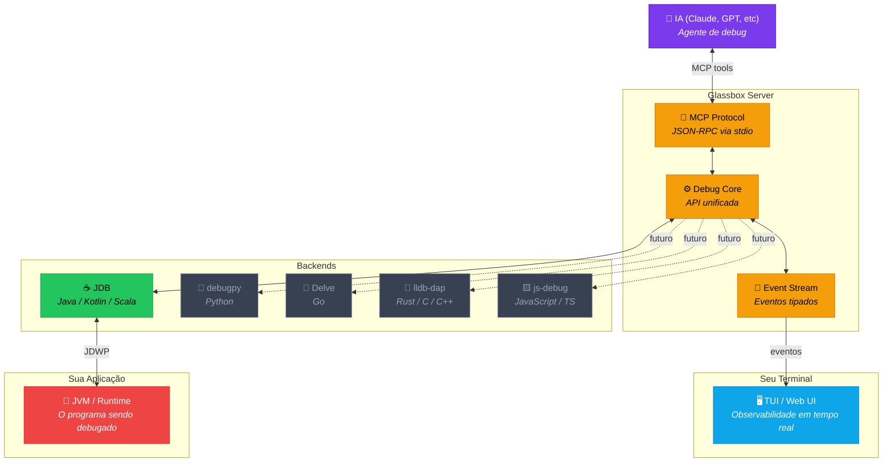
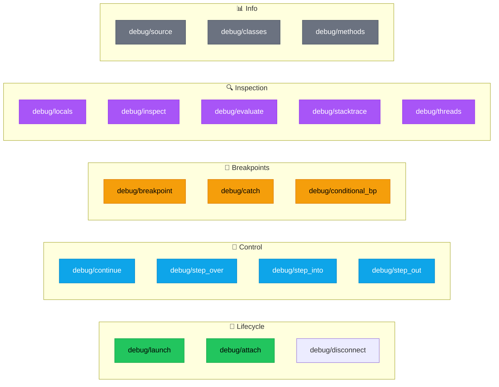
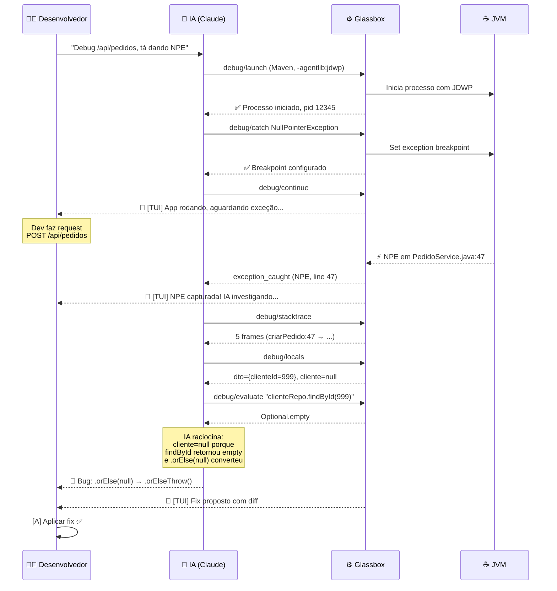
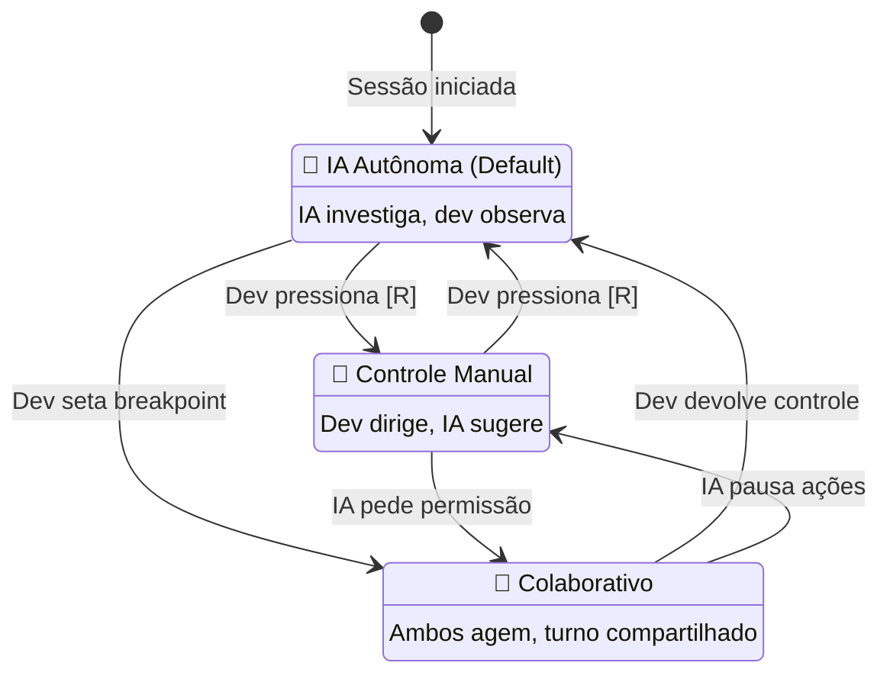
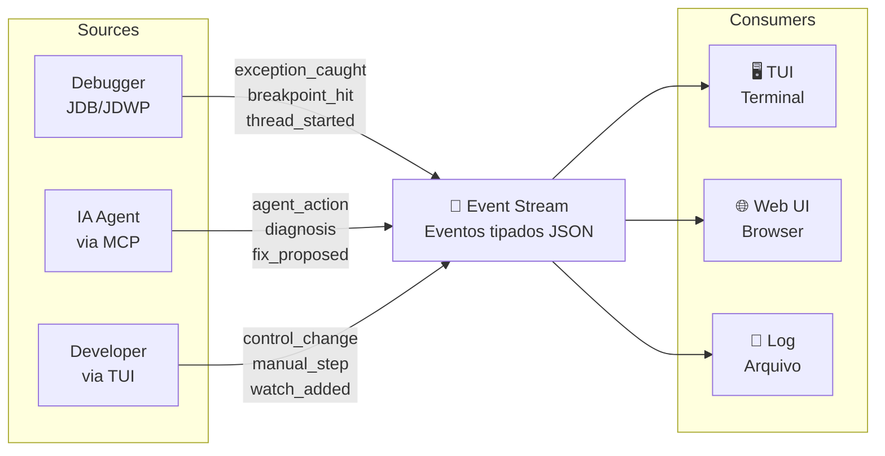

# Glassbox — Debug Inteligente para JVM

> **O debugger que a IA controla e você observa.**
> MCP Server + TUI para debug autônomo de aplicações Java, Kotlin e Scala.

---

## O Problema

Debugar aplicações JVM hoje segue um ciclo frustrante:

1. Desenvolvedor copia stack trace / logs
2. Cola no chat da IA (2000+ tokens)
3. IA pede mais contexto
4. Desenvolvedor volta ao código, adiciona `println`, recompila
5. Repete 5-10 vezes até achar o bug
6. **~15-30 minutos. ~5000+ tokens desperdiçados.**

## A Solução: Glassbox

Glassbox dá à IA **acesso direto ao debugger JVM** via MCP (Model Context Protocol).
Em vez de parsear logs, a IA executa comandos de debug cirurgicamente:

```
Antes (tradicional):           Depois (Glassbox):
─────────────────────          ──────────────────────
Dev → copia logs               Dev → "Debug meu endpoint /api/pedidos"
Dev → cola no chat             IA  → attach ao processo
IA  → "me manda mais"          IA  → set breakpoint em NPE
Dev → add println              IA  → catch exception
Dev → recompila                IA  → inspeciona variáveis
Dev → reproduz bug             IA  → avalia expressões
Dev → copia output             IA  → propõe fix
Dev → cola no chat             
IA  → "acho que é isso"        Resultado:
                               3.2 segundos, 87 tokens, fix exato.
~15-30 min, ~5000 tokens       ~95% menos tokens, ~90% menos tempo
```

---

## Arquitetura



---

## MCP Tools Disponíveis

A IA acessa o debugger através de **tools MCP padronizadas**:



### Exemplo de Chamada MCP

```json
// IA chama: debug/evaluate
{
  "method": "tools/call",
  "params": {
    "name": "debug/evaluate",
    "arguments": {
      "expression": "clienteRepo.findById(999)",
      "thread": "http-nio-8080-exec-1",
      "frame": 0
    }
  }
}

// Glassbox responde:
{
  "content": [{
    "type": "text",
    "text": "{\"type\": \"java.util.Optional\", \"value\": \"Optional.empty\"}"
  }]
}
```

---

## Fluxo de Debug: IA Encontra um NPE



---

## Modos de Operação



| Modo | Quem controla | Quando usar |
|------|--------------|-------------|
| **Autônomo** | IA lidera, dev observa | Bug report simples, IA resolve sozinha |
| **Manual** | Dev lidera, IA comenta | Dev sabe onde está o bug, quer explorar |
| **Colaborativo** | Ambos agem | Bugs complexos, exploração conjunta |

---

## Event Stream

Cada ação gera um evento tipado (JSON) que alimenta TUI e Web UI simultaneamente:



### Tipos de Evento

| Tipo | Source | Descrição |
|------|--------|-----------|
| `exception_caught` | debugger | Exceção atingiu breakpoint |
| `breakpoint_hit` | debugger | Breakpoint de linha atingido |
| `agent_action` | ai | IA executou uma tool MCP |
| `diagnosis` | ai | IA formulou diagnóstico |
| `fix_proposed` | ai | IA propôs correção com diff |
| `control_change` | user/ai | Troca de quem controla o debugger |
| `manual_step` | user | Dev executou step/eval manualmente |

---

## Roadmap

```mermaid
gantt
    title Glassbox — Roadmap de Desenvolvimento
    dateFormat YYYY-MM-DD
    axisFormat %b %Y

    section v0.1 — Foundation
    MCP Server básico (JDB)           :done, f1, 2025-02-01, 30d
    Tools: launch, breakpoint, locals  :done, f2, after f1, 20d
    Spec de observabilidade            :done, f3, after f1, 10d

    section v0.2 — Observabilidade
    TUI com Ratatui (Rust)             :active, o1, 2025-04-01, 30d
    Event Stream tipado                :o2, after o1, 15d
    Session Summary e métricas         :o3, after o2, 10d

    section v0.3 — Multi-backend
    DAP Protocol adapter               :m1, 2025-06-01, 30d
    Backend Python (debugpy)           :m2, after m1, 20d
    Backend Go (Delve)                 :m3, after m2, 20d

    section v0.4 — Web UI
    Web dashboard (React)              :w1, 2025-09-01, 30d
    Diff viewer e apply fix            :w2, after w1, 15d
    Colaboração em tempo real          :w3, after w2, 20d

    section v1.0 — Produção
    npm publish + pip install           :p1, 2025-12-01, 15d
    Documentação completa               :p2, after p1, 15d
    Launch público                      :milestone, p3, after p2, 0d
```

---

## Stack Tecnológico

| Componente | Tecnologia | Por quê |
|------------|-----------|---------|
| **MCP Server** | TypeScript (Node.js) | SDK oficial MCP, ecossistema maduro |
| **Debug Core** | TypeScript | Abstração sobre JDB/DAP |
| **JDB Backend** | JDB via child_process | Nativo da JVM, zero dependências |
| **TUI** | Rust + Ratatui | Performance, visual rico no terminal |
| **Web UI** | React + Tailwind | Para quem prefere browser |
| **Event Stream** | JSON over stdio/SSE | Simples, extensível, streamable |

---

## Quick Start (Futuro)

```bash
# Instalar
npm install -g @glassbox/mcp-server

# Usar com Claude Code
claude --mcp glassbox

# Ou configurar no claude_desktop_config.json
{
  "mcpServers": {
    "glassbox": {
      "command": "npx",
      "args": ["-y", "@glassbox/mcp-server"]
    }
  }
}
```

```bash
# Debug direto
Dev: "Debug meu PedidoService, tá dando NullPointerException"
# A IA faz o resto. Você assiste na TUI.
```

---

## Comparativo

| | Printf Debug | Log no Chat | **Glassbox** |
|---|---|---|---|
| **Tokens** | 0 (sem IA) | ~2000-5000 | **~87** |
| **Tempo** | 15-30 min | 10-20 min | **~3 seg** |
| **Precisão** | Depende do dev | Depende do contexto | **Cirúrgica** |
| **Recompilação** | 5-10 ciclos | 0 | **0** |
| **Custo** | Tempo do dev | $0.05-0.15 | **$0.003** |
| **IA vê estado real** | ❌ | ❌ (só texto) | **✅ (live)** |

---

## Licença

MIT — Open source, use como quiser.

---

*Glassbox: Porque debug não deveria ser um jogo de adivinhação.*
